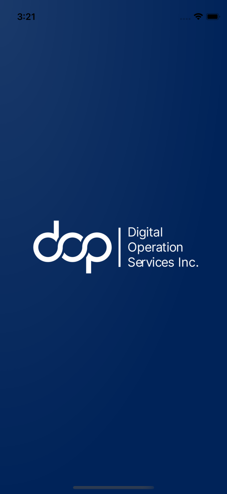

# timezone_by_area

Dünya Saatleri Uygulaması.

## Uygulamaya Başlarken :

Uygulama Flutter 2.10.3 versiyonunda kodlanmıştır.

Uygulamaya Android / IOS uygulama görünüm logosu dahil edilmiştir.

Uygulamada Android / IOS native splash ekranı bulunmaktadır.

Uygulamada kullanılan gerekli fontlar dahil edilmiştir.

Uygulamaya Unit Test yazılmıştır.

## Uygulamaya Ait Ekran Görüntüleri :

             

## Uygulama Videosu :

https://user-images.githubusercontent.com/32618134/185375601-c4b71fbc-9d31-4fd7-b5c7-0d59460be328.mp4

